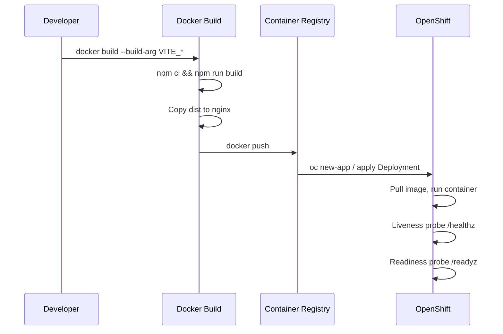

# Docker-based OpenShift Deployment Prompt

Use this prompt to prepare any Vite + React + TypeScript project for Docker-based OpenShift deployment.

```
You are preparing a Vite + React + TypeScript app for Docker-based OpenShift deployment.

Requirements:
- Use a multi-stage Dockerfile with a Node build stage and an Nginx runtime stage.
- Base images: node:22-alpine for build, nginxinc/nginx-unprivileged:stable-alpine for runtime (OpenShift non-root compliance).
- Use npm for installs and builds.
- Expose port 8080 and serve the app at "/".
- Support SPA routing (fallback to index.html).
- Include Kubernetes health check endpoints:
  - /healthz for liveness probe
  - /readyz for readiness probe
- Support Windows Integrated Authentication header passthrough (X-Remote-User, X-Forwarded-User).
- Provide a .dockerignore to exclude node_modules, .git, etc.
- Document build-time env vars (all VITE_*, Supabase keys, and API endpoints) in .env.example.
- Add README instructions for docker build/run.
- Do not include OpenShift YAML manifests or S2I configuration.

Please implement:
1. Dockerfile (multi-stage build)
2. docker/nginx.conf (with health endpoints and SPA routing)
3. .dockerignore
4. .env.example
5. README updates with build/run instructions
```

## Current Implementation

### Dockerfile
- Build stage: `node:22-alpine`
- Runtime stage: `nginxinc/nginx-unprivileged:stable-alpine`
- Build args: `VITE_SUPABASE_URL`, `VITE_SUPABASE_PUBLISHABLE_KEY`, `VITE_API_BASE_URL`
- Exposes port 8080

### Nginx Configuration
Located at `docker/nginx.conf`:
- Listens on port 8080
- Health check endpoints: `/healthz` and `/readyz`
- SPA routing with `try_files`
- WIA header passthrough
- Gzip compression enabled

### Build & Run

```bash
# Build with environment variables
docker build \
  --build-arg VITE_SUPABASE_URL=https://your-project.supabase.co \
  --build-arg VITE_SUPABASE_PUBLISHABLE_KEY=your-anon-key \
  --build-arg VITE_API_BASE_URL=https://your-api.example.com \
  -t raffle-app .

# Run locally
docker run -p 8080:8080 raffle-app

# Test health endpoints
curl http://localhost:8080/healthz
curl http://localhost:8080/readyz
```

### OpenShift Deployment Flow


