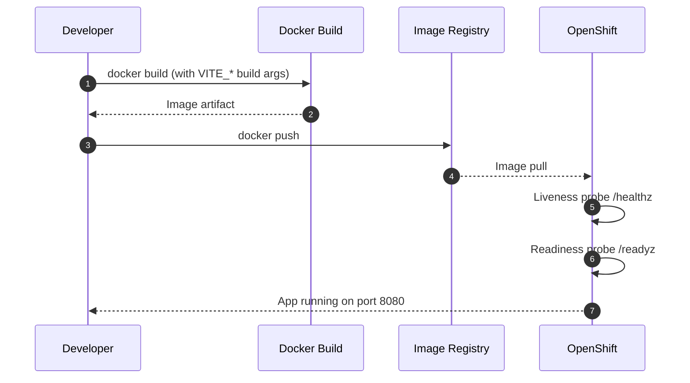

# Welcome to your Lovable project

## Project info

**URL**: https://lovable.dev/projects/REPLACE_WITH_PROJECT_ID

## How can I edit this code?

There are several ways of editing your application.

**Use Lovable**

Simply visit the [Lovable Project](https://lovable.dev/projects/REPLACE_WITH_PROJECT_ID) and start prompting.

Changes made via Lovable will be committed automatically to this repo.

**Use your preferred IDE**

If you want to work locally using your own IDE, you can clone this repo and push changes. Pushed changes will also be reflected in Lovable.

The only requirement is having Node.js & npm installed - [install with nvm](https://github.com/nvm-sh/nvm#installing-and-updating)

Follow these steps:

```sh
# Step 1: Clone the repository using the project's Git URL.
git clone <YOUR_GIT_URL>

# Step 2: Navigate to the project directory.
cd <YOUR_PROJECT_NAME>

# Step 3: Install the necessary dependencies.
npm i

# Step 4: Start the development server with auto-reloading and an instant preview.
npm run dev
```

**Edit a file directly in GitHub**

- Navigate to the desired file(s).
- Click the "Edit" button (pencil icon) at the top right of the file view.
- Make your changes and commit the changes.

**Use GitHub Codespaces**

- Navigate to the main page of your repository.
- Click on the "Code" button (green button) near the top right.
- Select the "Codespaces" tab.
- Click on "New codespace" to launch a new Codespace environment.
- Edit files directly within the Codespace and commit and push your changes once you're done.

## What technologies are used for this project?

This project is built with:

- Vite
- TypeScript
- React
- shadcn-ui
- Tailwind CSS

## Deployment

### Docker (OpenShift-friendly)

This deployment uses a multi-stage Docker build with an Nginx runtime, listening on port `8080` and serving the app at `/`.

**Key features:**
- Multi-stage build: `node:22-alpine` → `nginxinc/nginx-unprivileged:stable-alpine`
- OpenShift non-root compliance
- Kubernetes health check endpoints (`/healthz`, `/readyz`)
- SPA routing with fallback to `index.html`
- Windows Integrated Authentication header passthrough
- Gzip compression

#### Build-time environment variables

Vite injects environment variables at build time, so provide them during the Docker build. See `.env.example` for the required values.

```bash
docker build \
  --build-arg VITE_SUPABASE_URL="https://your-project.supabase.co" \
  --build-arg VITE_SUPABASE_PUBLISHABLE_KEY="your-key" \
  --build-arg VITE_API_BASE_URL="https://api.example.com" \
  -t sparklight-raffle:latest .
```

#### Run locally

```bash
docker run --rm -p 8080:8080 sparklight-raffle:latest
```

#### Test health endpoints

```bash
curl http://localhost:8080/healthz  # Liveness probe
curl http://localhost:8080/readyz   # Readiness probe
```

#### Deployment flow



#### File structure

```
├── Dockerfile              # Multi-stage build
├── docker/nginx.conf       # Nginx config with health endpoints
├── .dockerignore           # Excludes node_modules, .git, etc.
└── .env.example            # Document required env vars
```

For a reusable deployment prompt, see `DEPLOYMENT_PROMPT.md`.

## Can I connect a custom domain to my Lovable project?

Yes, you can!

To connect a domain, navigate to Project > Settings > Domains and click Connect Domain.

Read more here: [Setting up a custom domain](https://docs.lovable.dev/features/custom-domain#custom-domain)
